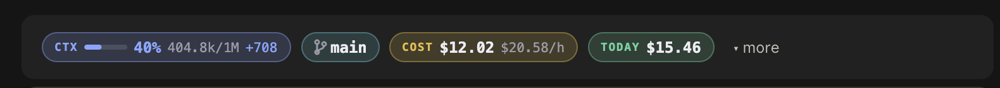
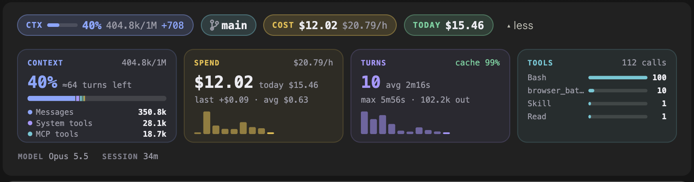
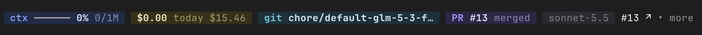
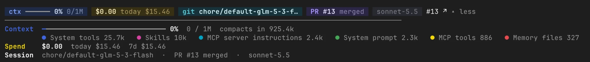

# usage-bar

A Claude Code mod: a live band above the prompt with your context window,
spend, rate limits, git state and pull request, plus a `▾ more` panel that
shows where the context and the money went.

Works in the Claude Code CLI and the desktop app's Code tab. Requires Claude
Code 2.1.287 or later.









## Install

```
/plugin marketplace add abyigiter/claude-usage-bar
/plugin install usage-bar@abyigiter-mods
/reload-plugins
```

Update later with `/plugin marketplace update abyigiter-mods`, then
`/reload-plugins`.

## The header

Each figure is a pill colored by what it is, turning yellow or red when it
needs attention. Pills flow in one row and wrap as units.

| Pill | Shows |
| --- | --- |
| `5H` / `7D` | Rate-limit use with a bar, a pace tick at the window's elapsed time, and the reset countdown. Yellow when your pace would hit 100% before reset, red past 150% pace or 90% used. Hidden off a subscription. |
| `CTX` | Context window fill, tokens, and the last turn's growth. |
| `● 0:42` | A live timer while Claude works. |
| git | Branch, lines added and removed against HEAD (`+421 −68`), untracked files (`?1`), ahead and behind. |
| PR | The branch's pull request through `gh`: state, review, CI (`✓` pass, `✗` fail, `●` running). Re-checked every 5 minutes, every minute while CI runs, with a toast when it finishes. Needs the GitHub CLI signed in. |
| `COST` | Session spend and burn rate (`$/h`), against your budget when one is set. |
| `TODAY` | Spend across every session today, and the last 7 days. |

In the terminal the same figures are tinted chips.

## The detail panel

`▾ more` opens four cards on desktop (aligned rows in the terminal). Cards
with nothing to show yet are left out.

- **Context**: a stacked bar by `/context` category (messages, tools, MCP,
  memory, skills) and how many turns are left before auto-compact at your
  average growth.
- **Spend**: total, today, last turn, average per turn, a bar per turn.
- **Turns**: count, average and longest duration, prompt cache hit rate,
  tokens written, a bar per turn.
- **Tools**: the top five tools (MCP names shortened). Failing CI checks are
  listed under the panel.

## Budgets

```
/budget 10          session budget of $10
/budget day 50      daily budget of $50
/budget off         clear both (or /budget off day, /budget off session)
/budget             show where you stand
```

A toast fires at 80% and at 100% of each budget, and once when your burn
rate will cross the session budget within 15 minutes.

## Today's spend

Each session keeps its own running total per local day in the plugin store
(kept 30 days); today is the sum over sessions. A session that began today
counts in full, one carried over from an earlier day counts from its first
reading today.

## `/usage`

Prints everything above as text: limits with pace, context, session cost,
today and the last 7 days, budgets, turns and cache hit rate, tools, edited
files, git and PR with failing checks, model.

## Building it

A standard mod plugin: `.claude-plugin/plugin.json`, `hooks/hooks.json`, one
hooks module. Readings come from `$.session.usage()` on `session.measure`,
`turn.complete` and a one-minute timer; the context breakdown from
`$.session.usage({ breakdown: "summary" })`, a local estimate. The header and
cards on desktop are SVG drawings; the terminal draws Ink text. State lives in
`$.state` so it survives hot reloads; budgets and the day totals in
`$.store`.

Tests: `claude plugin test ./usage-bar`.
